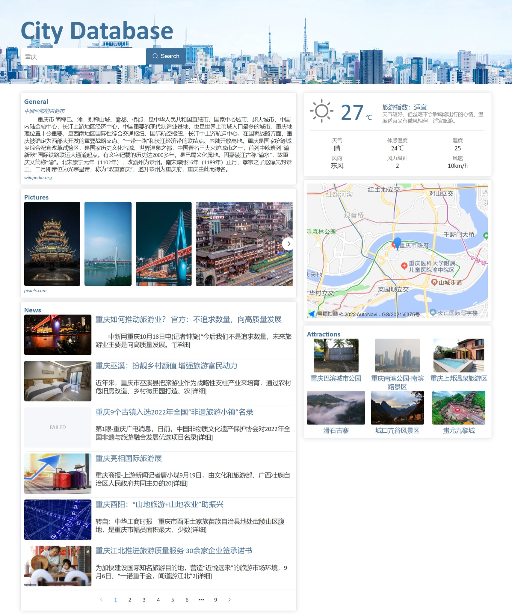

# City Database Online

## 01 Configuration

### 1.1 工具

- `node.js`
- `vue3 + Element plus`
- `Visual Studio Code`

### 1.2 API来源

|      | 城市信息| 接口文档 | 请求方式 | URL| 返回数据类型 |
| ---- | -------| ---- | :----: | ----- | :---: | 
| 1    | **简介** | [维基百科](https://zh.wikipedia.org/api/rest_v1/)  | GET | `https://zh.wikipedia.org/api/rest_v1/page/summary` | json |
| 2    | **图片** | [Pexels](https://www.pexels.com/zh-cn/api/documentation/#photos-search)  | GET | `https://api.pexels.com/v1/search` | json |
| 3   | **经纬度** | [高德地图](https://lbs.amap.com/api/webservice/guide/api/georegeo)  | GET | `https://restapi.amap.com/v3/geocode/geo` | json |
| 4   | **景点** | [高德地图](https://lbs.amap.com/api/webservice/guide/api/search)  | GET | `https://restapi.amap.com/v3/place/text` | json |
| 5   | **新闻** | [天行数据](https://www.tianapi.com/apiview/15)  | GET | `http://api.tianapi.com/travel/index` | json |
| 6   | **实时天气** | [和风天气](https://dev.qweather.com/docs/api/weather/weather-now/)  | GET | `https://devapi.qweather.com/v7/weather/now` | json |
| 7   | **旅游指数** | [和风天气](https://dev.qweather.com/docs/api/indices/indices-forecast/)  | GET | `https://devapi.qweather.com/v7/indices/1d` | json |
### 1.3 运行
1. Project setup
```
npm install
```
2. Compiles and hot-reloads for development
```
npm run dev
```

## 02 Implementation
### 2.1 Purpose
通过整合开放的城市数据API实现一个在线城市数据库。
### 2.2 Perspectives
我的应用主要整合了一些旅游相关的数据，包含以下几个板块：
* General：城市基本信息介绍，数据来源于维基百科，国内访问需要科学上网。
* Pictures：城市的图片，数据来源于Pexels，因为是国外的网站对中文搜索的支持不高，需要将中文城市名转换为拼音或者英语才能获得更多搜索结果。
* News：城市相关的旅游新闻，数据来源于新浪，API接口提供商为天行数据。通过接口可获取新闻的图片、标题、部分正文和新闻链接。点击新闻列表可跳转到新闻详情界面。
* Weather：城市实时天气，包括气温、体感温度、风力级别、旅游指数等。数据来源于和风天气，需要提供经纬度作为参数。城市名到经纬度的转换由高德地图Web服务的地理编码API实现。
* Map：展示城市在地图上的位置，通过高德地图JS API实现。
* Attractions：推荐城市内著名景点，数据来源于高德地图Web服务的搜索POI板块。指定城市并将查询POI类型设置为110202，即可获取该城市的国家级风景名胜信息。
### 2.3 Screenshot
